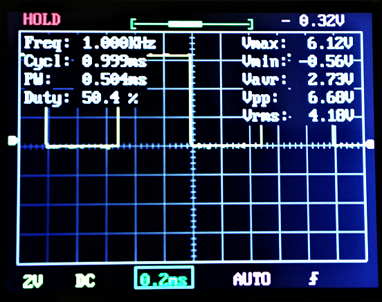

# Direct Memory Access (DMA) PWM for the Raspberry Pi

dma_pwm.c provides flexible hardware pulse width modulation (PWM) for the Raspberry Pi via the direct memory access (DMA) controller. Providing PWM via DMA frees the CPU thus allowing low processor usages to programs driving DC motors, servos, LEDs, etc. using the general purpose input/output (GPIO) pins. Unlike the Pi's built-in PWM controller, any number of GPIO pins can be driven over a total of 10 individual channels. This software requires no dependencies other than Raspbian running on any version of the Raspberry Pi.



*1 Khz PWM signal at 50% duty cycle on an oscilloscope produced by dma_pwm.c*

Other examples of DMA PWM, and ones that this project is based on, are Chris Hager's [RPIO](https://github.com/metachris/RPIO) and Richard Hirst's [ServoBlaster](https://github.com/richardghirst/PiBits/tree/master/ServoBlaster). Unfortunately, these projects are no longer actively maintained so dma_pwm.c serves to bridge the gap and continue to provide an up-to-date and easy-to-use library of functions to achieve flexible hardware PWM on the Pi. This project also emphasizes documenting how PWM via DMA is achieved to allow anyone a better understanding of the Raspberry Pi and low-level programming in general.

dma_pwm.c is provided two ways for flexibility:
1. C source and header files that can be compiled along with your program
2. C shared library

To better understand the source code and theory behind DMA PWM on the Pi, see [raspberry_pi_dma_pwm.pdf](doc/raspberry_pi_dma_pwm.pdf) for a complete breakdown on how and why this works.

## Getting Started

These instructions will get you a copy of the project up and running on your local machine for development and testing purposes.

### Installing

#### Obtain the Project

First, clone this repository.

```
$ git clone https://github.com/besp9510/dma_pwm.git
```

Alternatively, download the repository from Git.

#### Configure

Once obtaining a copy on your local machine, navigate to the top directory and run the configure script to generate a Makefile.

```
$ ./configure
```

By default, files will be installed under `/usr/local/`. Note that passing the option ``--help`` will display available configuration options such as installation directory prefix, debug symbols, and debug logs.

#### Make

Compile dma_pwm.c into a shared library.

```
$ make
```

Then install files to the installation directory. You must run the following either as root or with root privileges.

```
$ sudo make install
```

#### Uninstall
At anytime, to uninstall dma_pwm.c, use the same Makefile used for compiling or a Makefile generated using the configuration script with the same options as root or with root privileges.

```
$ sudo make uninstall
```

## Running the Test

dma_pwm_test.c is a test script to check and see PWM via DMA works on your Raspberry Pi and provide examples on how to use dma_pwm.c. The outline of this test script:
1. Configuring dma_pwm.c
2. Requesting a PWM channel
3. Setting a PWM signal
4. Enabling the PWM signal
5. Updating the PWM signal
6. Get signal properties
7. Disabling the PWM signal
8. Freeing the PWM channel

To compile the test script, first navigate to the test directory `test/`. Next, run the configure script to generate the Makefile:

```
$ ./configure
```

By default, the dma_pwm.c shared library will be looked for under the standard directories (e.g. `/usr/local/`). If this is not the case, pass the option ``--help`` to learn how to specify a directory to be searched. Additionally, ``--help`` will also display available configuration options such as debug symbols and debug logs.

Next, compile the test script one of two ways: link shared library or compile with source.

```
$ make library
```

or

```
$ make source
```

Both will create an executable called `dma_pwm_test` under `bin/`. While running the test script, either monitor the output of the selected GPIO pin using a LED, oscilloscope, ect.


*Video of dma_pwm_test.c*

## Documentation

### How it Works
To better understand the source code and theory behind DMA PWM on the PI, see [raspberry_pi_dma_pwm.pdf](doc/raspberry_pi_dma_pwm.pdf) for a complete breakdown on how and why this works. This reference documents
1. What DMA is and what DMA controllers are
2. Using the DMA controller on the Pi
3. PWM and the DMA controller
4. DMA controller to create PWM
5. Implementation in C

Note that this reference has register addresses specific to the BCM2836/BCM2837 (Raspberry Pi 2 & 3) processor. The peripheral base physical address for the other PI versions are:
* Raspberry Pi 1 & Zero (BCM2835) : 0x20000000
* Raspberry Pi 4 (BCM2711) : 0xFE000000

Additionally, an Excel spreadsheet ["dma_pwm_pulse_width_calculator.xlsx"](doc/dma_pwm_pulse_width_calculator.xlsx) is provided to allow easy calculation of custom pulse widths (more discussion below on this).

### Functions

You must run dma_pwm.c as root or with root privileges.

#### Configure PWM
Configure amount of memory pages allocated, pulse width in microseconds of the PWM signal, and Pi version away from defaults. This function call is not required to request a channel and enable PWM, but is required prior to requesting a channel for any configuration change to take effect. This function call will then fail if any channel has been requested. Note that these configurations effect all channels (e.g, and and all PWM signals regardless of channel will have the same pulse width).

```c
float config_pwm(int pages, float pulse_width);
```

The amount of pages allocated `int pages` describes the amount of uncached memory allocated by each PWM channel. Note that a "ping-pong" buffer is used to minimize signal interruption when `set_pwm()` updates an already enabled signal so multiply `int pages` by 2 to get the total amount of allocated memory. This defaults to `DEFAULT_PAGES` or 16 pages (65,536 bytes for 4096-byte page systems).

Pulse width in microseconds of the PWM signal `float pulse_width` is the length of time in which a GPIO pin remains set or cleared. Determining an appropriate pulse width is a function of the allocated memory pages, desired frequency range, and desired duty cycle resolution. See [raspberry_pi_dma_pwm.pdf](doc/raspberry_pi_dma_pwm.pdf) and ["dma_pwm_pulse_width_calculator.xlsx"](doc/dma_pwm_pulse_width_calculator.xlsx) for a discussion on how to calculate this for yourself, but several presets are available targeting an appropriate pulse width for servos `SERVO_PULSE_WIDTH`, D.C motors `MOTOR_PULSE_WIDTH`, and LEDs `LED_PULSE_WIDTH`. This defaults to `DEFAULT_PULSE_WIDTH` or 5 us. Use the following recommendations for frequency ranges for the above presets to achieve a duty cycle within 10% of desired at the default allocated memory:
1. `DEFAULT_PULSE_WIDTH` : 100 Hz - 20 kHz
2. `SERVO_PULSE_WIDTH` : 50 Hz - 10 kHz
3. `MOTOR_PULSE_WIDTH` : 5 kHz - 1 Mhz
4. `LED_PULSE_WIDTH` : 0.05 Hz - 10 Hz

Note that these ranges are suggestions but feel free to calculate a pulse width that will be suite your application. Note that acceptable pulse widths lie above 0.5 us. Strange behavior was seen for any pulse width lower than this value.

##### Return Value
`config_pwm()` return 0 upon success. On error, an error number is returned.

Error numbers:
* `ECHNLREQ` : At least one channel has been requested; release all requested channels prior to function call.
* `EINVPW` : Invalid pulse width; pulse width must be between 0.002 us and 35,175,782,146 us.

#### Request PWM Channel
Request a DMA channel to create a PWM signal.

```c
int request_pwm();
```

##### Return Value
`request_pwm()` returns the channel number upon success. On error, an error number is returned.

Error numbers:
* `ENOFREECHNL` : No free DMA channels available to be requested.
* `ENOPIVER` : Could not get Pi board revision.
* `EMAPFAIL` : Peripheral memory mapping failed.
* `ESIGHDNFAIL` : Signal handler failed to setup.

#### Set PWM Signal
Set a PWM signal on a requested channel for selected GPIOs at a desired frequency in Hz and duty cycle in percent (%). This function call is required prior to enabling (outputting) PWM on a requested channel. If a PWM signal is already set and enabled for a requested channel, this function serves as a method to update the PWM signal. The signal is updated immeadiately and does not require any additional function calls in this case. Note, a "ping-pong" buffer exists internally within dma_pwm.c that minimizes the interruption time for PWM signal updates to allow near-continuous output of a signal. 

```c
int set_pwm(int channel, int* gpio, size_t num_gpio, float freq, float duty_cycle);
```

The channel number `int channel` is a previously requested channel obtained by a `request_pwm()` call.

A vector of GPIO pins `int* gpio`, and the number of pins (size of said vector) `size_t num_gpio`, describes which GPIO pins will output the desired PWM signal. This is a vector of non-zero length containing any BCM GPIO pin numbers. Note that there is no check within pwm_dma.c to which GPIO pins are used to produce a PWM signal meaning it is your responsibility to choose pins wisely. See [Raspberry Pi documentation on GPIOs](https://www.raspberrypi.org/documentation/usage/gpio/) for more information on this.

PWM signal properties `float freq` and `float duty_cycle` are desired frequency in Hz and duty cycle in percent (%) of the PWM signal. Note that desired frequency and duty cycle may not be the actual frequency and duty cycle of an output PWM signal; this is caused by dma_pwm.c's current configuration (`config_pwm()`), what the desired frequency and duty cycle values are, and the inherit limitations of PWM via DMA. See [raspberry_pi_dma_pwm.pdf](doc/raspberry_pi_dma_pwm.pdf) for a complete discussion on why this is. If using default or the preset pulse widths, and are following the recommended frequency ranges, then actual signal properties will closely match desired. If unsatisfactory, you can configure pulse width to better suite your application and achieve actual signal properties closer to what is desired.

##### Return Value
`set_pwm()` returns 0 upon success. On error, an error number is returned.

Error numbers:
* `EINVCHNL` : Invalid or non-requested channel; channel must be requested from `request_pwm()`.
* `EINVDUTY` : Invalid duty cycle; duty cycle must be between 0% and 100%.
* `EINVGPIO` : Invalid GPIO pin; acceptable pins are between 0 and 31 inclusive.
* `EFREQNOTMET` : Desired frequency cannot be met; the frequency is too high for the configured pulse width. Change the pulse width using `configure_pwm()`.
* `ENOMEM` : Amount of memory required to produce the PWM signal is greater than what is allocated; increase the amount of pages allocated or change the pulse width using `config_pwm()`.

#### Enable PWM Signal
Enable (output) an already set PWM signal on a requested channel. The PWM signal will output to the selected GPIO pins immediately upon function call. A function call to `set_pwm()` is required prior to enabling.

```c
int enable_pwm(int channel);
```

The channel number `int channel` is a previously requested channel obtained by from `request_pwm()`.

##### Return Value
`enable_pwm()` returns 0 upon success. On error, an error number is returned.

Error numbers:
* `EINVCHNL` : Invalid or non-requested channel; channel must be requested from `request_pwm()`.
* `EPWMNOTSET` : PWM signal on requested channel has not been set; PWM must be set using `set_pwm()`.

#### Disable PWM Signal
Disable (stop output) a PWM signal on a requested channel. The PWM signal will immeadiately stop outputting and the selected GPIO pins will be cleared. 

```c
int disable_pwm(int channel);
```

The channel number `int channel` is a previously requested channel obtained by a `request_pwm()` call.

##### Return Value
`disable_pwm()` returns 0 upon success. On error, an error number is returned.

Error numbers:
* `EINVCHNL` : Invalid or non-requested channel; channel must be requested from `request_pwm()`.

#### Free PWM Channel
Free a requested channel by freeing allocated memory and clearing GPIO pins. This function call should **always** be used prior to program exit as the allocated memory associated with the channel will not automatically be freed after program exit. This is because non-cached memory is allocated via the VideoCore interface. If memory is not freed after use, expect dma_pwm.c to break; resolve this issue by power cycling the Pi. Note that in the case of unexpected program termination, dma_pwm.c has signal handlers that will call `free_pwm()` for cases of `SIGHUP`, `SIGQUIT`, `SIGINT`, and `SIGTERM` signals to ensure allocated memory is freed.

```c
int free_pwm(int channel);
```

The channel number `int channel` is a previously requested channel obtained by a `request_pwm()` call.

##### Return Value
`free_pwm()` returns 0 upon success. On error, an error number is returned.

Error numbers:
* `EINVCHNL` : Invalid or non-requested channel; channel must be requested from `request_pwm()`.

#### Get PWM Signal Properties
Get PWM signal properties frequency and duty cycle. The properties returned are the actual properties of the signal outputed to selected GPIO pins and may not match the desired frequency and duty cycle passed into `set_pwm()`. 

```c
float get_duty_cycle_pwm(int channel);
```

```c
float get_freq_pwm(int channel);
```

The channel number `int channel` is a previously requested channel obtained by a `request_pwm()` call.

##### Return Value
`get_duty_cycle_pwm()` and `get_freq_pwm()` returns duty cycle in percent (%) and frequency in Hz upon success. On error, an error number is returned.

Error number:
* `EINVCHNL` : Invalid or non-requested channel; channel must be requested from `request_pwm()`.

#### Get Pulse Width
Get the pulse width in microseconds of all PWM signals. 

```c
float get_pulse_width()
```

##### Return Value
`get_pulse_width()` always returns the pulse width in microseconds. 

## Contributing
Follow the "fork-and-pull" Git workflow.
1. Fork the repo on GitHub
2. Clone the project to your own machine
3. Commit changes to your own branch
4. Push your work back up to your fork
5. Submit a Pull request so that your changes can be reviewed

Be sure to merge the latest from "upstream" before making a pull request!

Feel free to email at the email address under my account name if you have any questions.
## Authors

Benjamin Spencer

## License

This project is licensed under the MIT License - see the [LICENSE.md](LICENSE.md) file for details

## Acknowledgments

* Chris Hager's [RPIO](https://github.com/metachris/RPIO) 
* Richard Hirst's [ServoBlaster](https://github.com/richardghirst/PiBits/tree/master/ServoBlaster)
